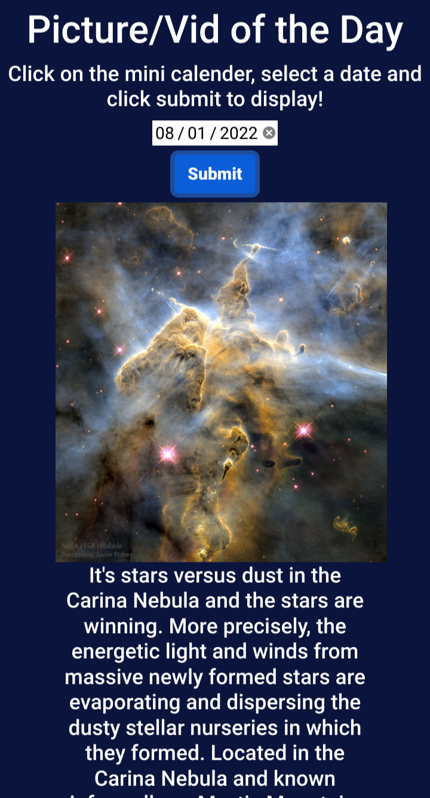

  <!-- Start of table with Portfolio and Nasa Api -->
  <tr align="center">
    <td width="50%" valign="top"> <!--Start of Nasa API taking 50% of view window-->
      <h3 align="center">Nasa Picture of the Day</h3>
        <!--Click Nasa Api image to open a new window to Nasa API website-->
      
       
      
 
      </a> <!--Click website icon link to open a new window to Nasa API website-->
      
      
 <!--Desciption of technologies and functionality of Nasa API-->
        
<strong>HTML, CSS, JS, Node.js, dotenv, Git/Github, Nasa API</strong> - Fetch Historical Nasa API by Day

    </td> <!--End of Nasa API-->    
  </tr> <!--End of table row of Portfolio and Nasa API-->
